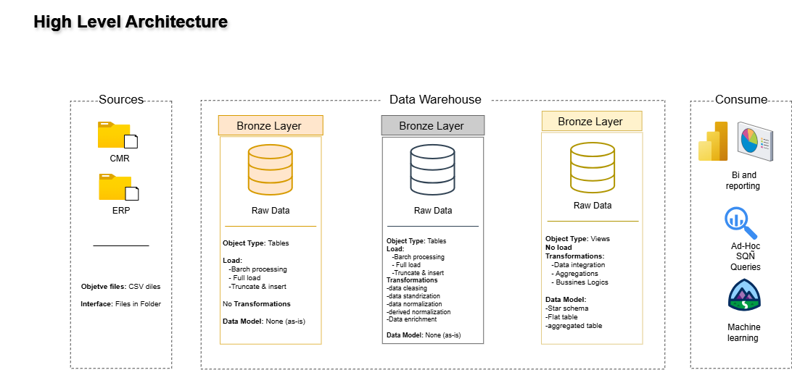

# Modern SQL Data Warehouse – Sales Analytics Project

This project focuses on building a **Modern SQL Data Warehouse** designed to support sales analytics and data-driven decision making. The solution integrates data from two source systems (**CRM and ERP**) provided in CSV format, applying ingestion, data cleaning, transformation, and analytical modeling processes.

The architecture follows the **Medallion approach (Bronze, Silver, and Gold layers)** to ensure raw data traceability, standardized and quality-controlled datasets, and finally business-ready data delivered through a **dimensional Star Schema model** (fact and dimension tables).

The implementation uses **SQL Server** as the main engine and follows industry best practices such as **batch ETL processing, stored procedure automation, standardized naming conventions, and version control with GitHub**.

The data architecture for this project follows Medallion Architecture Bronze, Silver, and Gold layers: 

